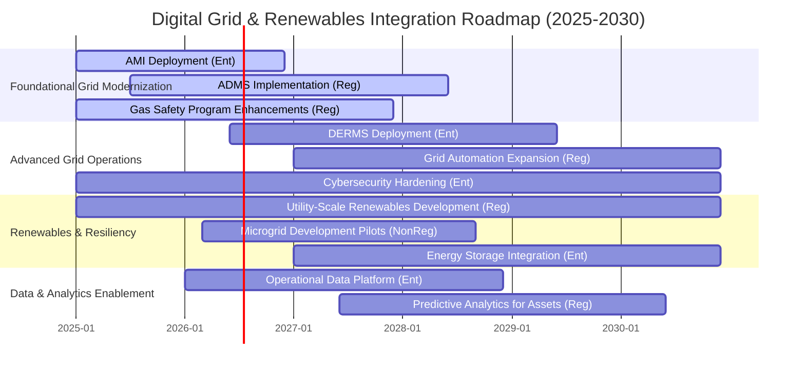
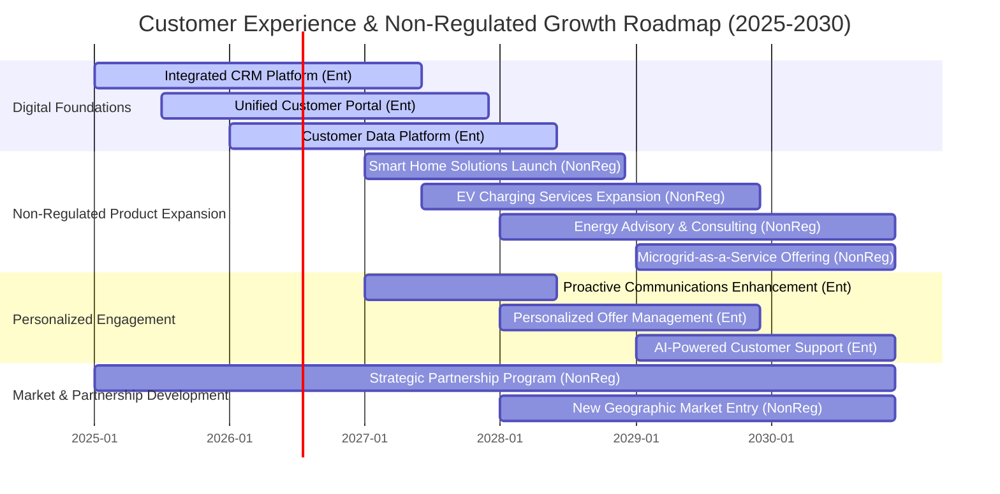
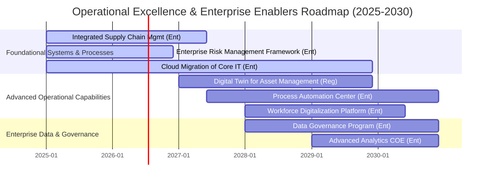

# Quantum Energy Strategic Roadmaps
## Visualizing the Path to 2030

**Document Version:** 1.0
**Date:** 2025-11-25
**Scope:** High-level strategic roadmaps for Quantum Energy (2025-2030)
**Framework Standards:** BIZBOK, Strategy to Reality
**Related Documents:**
*   [Quantum Energy Strategic Plan](../ent-strategic-plan.md)
*   [Quantum Energy Strategic Themes](../ent-strategic-themes.md)
*   [Quantum Energy Strategic Objectives](../ent-strategic-objectives.md)
*   [Quantum Energy Strategy-Capability Mapping](../ent-strategy-capability-mapping.md)
*   [Enterprise Capabilities L1-L2](../../3-CAPABILITIES/ent-capabilities-l1-l2.md) (to be developed)

---

## Executive Summary

This document presents high-level strategic roadmaps that visualize Quantum Energy's journey to achieve its 2025-2030 strategic objectives. These roadmaps illustrate the planned evolution of key capabilities and the sequencing of strategic initiatives across both our regulated utility operations and our non-regulated advanced energy solutions. They serve as a communication tool to depict how we will collectively deliver on our strategic themes, balancing stability with innovation and growth.

---

## 1. Introduction to Roadmapping

Quantum Energy utilizes roadmaps to articulate the phased evolution of its business architecture, primarily focusing on capability enhancements over time. These roadmaps connect our strategic vision to actionable plans, providing clarity on:
*   **What capabilities** will be strengthened or developed.
*   **When** these changes are expected to occur.
*   **How** strategic initiatives contribute to capability evolution.
*   **Dependencies** between different areas of strategic focus.

The roadmaps are presented at a high level and will be supported by more detailed initiative-specific plans and capability maturity assessments.

---

## 2. Roadmap: Digital Grid & Renewables Integration

This roadmap illustrates the planned evolution of capabilities critical for modernizing Quantum Energy's regulated grid infrastructure and integrating an increasing amount of renewable and distributed energy resources.

**Key Highlights:**
*   **AMI Deployment** (`Metering and Measurement` capability) provides the foundational data for all subsequent digital grid initiatives.
*   **ADMS** (`Electric Distribution`, `System Operations`) and **DERMS** (`Demand-Side Management`) are critical for managing an increasingly complex grid with high DER penetration.
*   **Non-regulated Microgrid Pilots** demonstrate innovation and potential for new service offerings, leveraging core regulated grid capabilities.
*   Continuous **Cybersecurity Hardening** is a cross-cutting initiative ensuring the integrity of the evolving digital infrastructure.

---

## 3. Roadmap: Customer Experience & Non-Regulated Growth

This roadmap highlights the evolution of customer-facing capabilities and the strategic expansion of non-regulated offerings, driven by customer-centricity and market diversification.

**Key Highlights:**
*   **Integrated CRM** (`Customer Engagement and Service`) and **Unified Customer Portal** provide the foundation for a seamless customer journey across regulated and non-regulated offerings.
*   **Customer Data Platform** (`Information`) enables advanced analytics for personalized engagement.
*   **Non-regulated product launches** are strategically sequenced to build momentum and diversify revenue, leveraging the modernized customer engagement capabilities.
*   **Strategic Partnerships** (`Non-Regulated Sales & Marketing`) are critical enablers for rapid market entry and scaling of non-regulated services.

---

## 4. Roadmap: Operational Excellence & Enterprise Enablers

This roadmap focuses on cross-cutting initiatives to drive operational efficiency, optimize asset performance, and strengthen foundational enterprise capabilities across Quantum Energy.

**Key Highlights:**
*   **Integrated Supply Chain Management** (`Procurement and Supply Chain`) improves efficiency and cost-effectiveness across all business units.
*   **Cloud Migration of Core IT** (`Information Technology & Digital Services`) provides a scalable and flexible platform for future growth and innovation.
*   **Digital Twin** and **Process Automation** initiatives (`Asset Management`, `Process Optimization & Automation`) drive significant operational efficiencies and asset performance improvements in regulated operations.
*   **Workforce Digitalization** (`Human Capital Management`) supports enhanced productivity for both field crews and non-regulated service teams.
*   **Data Governance** (`Information`) and **Advanced Analytics COE** are critical enablers for data-driven decision making across the entire enterprise, supporting both regulated compliance and non-regulated market insights.

---

## Document Control

**Author:** Quantum Energy Business Architecture Team
**Reviewers:** Strategic Planning Office, BA Review Board
**Approval:** Chief Strategy Officer
**Version History:**
- v1.0 (2025-11-25): Initial draft of Strategic Roadmaps for Quantum Energy.

**Next Review:** Annually (aligns with Strategic Plan review)

---

**End of Document**
