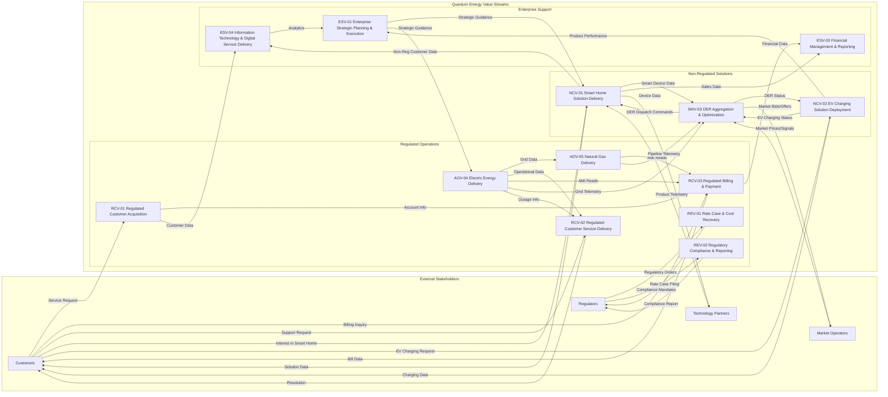

# Value Stream Information Flows - Overview
## Quantum Energy - High-Level Data Exchange Across Value Streams

**Document Version:** 1.0
**Date:** 2025-11-25
**Scope:** High-level overview of critical information flows across Quantum Energy's key value streams
**Framework Standards:** BIZBOK
**Related Documents:**
*   [Enterprise Value Streams Catalog (ent-value-streams-catalog.md)](../../4-VALUE-STREAMS/ent-value-streams-catalog.md)
*   [Enterprise Business Information Model - Conceptual (ent-business-information-model.md)](../ent-business-information-model.md)

---

## Executive Summary

This document provides a high-level overview of critical information flows across Quantum Energy's key value streams. Understanding these data exchanges is essential for optimizing operational efficiency, enhancing customer experience, ensuring data integrity, and identifying integration points between different business functions. It highlights how information traverses regulated and non-regulated operations, necessitating careful data governance and architectural design.

---

## 1. Introduction

Information flow describes the movement of data between different stages, capabilities, or systems within and across value streams. Efficient and accurate information flow is the lifeblood of Quantum Energy's operations, enabling timely decision-making, automated processes, and informed stakeholder interactions.

---

## 2. Conceptual Information Flow Diagram (Illustrative)

---

## 3. Key Information Flow Patterns

### 3.1. Customer-Centric Flow

*   **Unified Customer Data:** Information flows from regulated customer acquisition (RCV-01) and non-regulated solution delivery (NCV-01) to the central IT systems (ESV-04) to build a unified customer profile (Customer Profile, Customer Account entities). This enables consistent service delivery (RCV-02) and personalized offers.
*   **Bidirectional Interaction:** Customers (External Stakeholder A) interact with Quantum Energy's service delivery value streams (RCV-02, NCV-01, NCV-02) to request services and receive information.
*   **Consent Management:** For non-regulated offerings, explicit customer consent governs the flow of granular smart device data to analytics platforms (ESV-04) and potentially to DER aggregation (SMV-03).

### 3.2. Operational Flow (Regulated)

*   **Grid Telemetry:** Real-time operational data (Grid State, Asset Performance) from Electric Energy Delivery (AOV-04) and Natural Gas Delivery (AOV-05) continuously flows to System Operations & Grid Control (L1 Capability) for monitoring and control.
*   **Meter-to-Bill:** Meter Readings from AMI systems (via Metering & Measurement L1 Capability) flow to Regulated Billing & Payment (RCV-03) to generate bills.
*   **Outage Management:** Outage Event information from AOV-04/AOV-05 triggers flows to RCV-02 for customer communication.

### 3.3. Non-Regulated Solution Delivery Flow

*   **Product Development to Delivery:** Market insights (from Market Development L1 Capability) inform Non-Regulated Product Development (L1 Capability), leading to products that are delivered via NCV-01 (Smart Home Solution Delivery) or NCV-02 (EV Charging Solution Deployment).
*   **Smart Device Data to Insights:** Smart Device Data (from NCV-01, NCV-02) flows to ESV-04 (IT & Digital Services) for storage and analysis, generating insights that feedback into Non-Regulated Product Development or Customer Engagement & Service.

### 3.4. Regulatory & Financial Flow

*   **Reporting:** Operational and financial data flows from AOV, RCV, NCV, and ESV value streams to Financial Management & Reporting (ESV-03) and Regulatory Compliance & Reporting (REV-02) for external reporting (to External Stakeholder B: Regulators).
*   **Cost Allocation:** Financial data (Financial Transaction entity) is meticulously allocated between regulated and non-regulated segments (within ESV-03) to ensure compliance and transparency (feeding REV-01 Rate Case).

### 3.5. Enterprise Support Flow

*   **Strategic Direction:** Enterprise Strategic Planning & Execution (ESV-01) provides strategic guidance and objectives that influence all other value streams.
*   **Data & Analytics:** Information Technology & Digital Service Delivery (ESV-04) provides the platform and capabilities for data management and analytics that support insights for all value streams (e.g., Customer Insights & Analytics L2 Capability).

---

## 4. Key Considerations for Information Flow Design

*   **Data Latency:** Criticality of real-time vs. batch processing for different flows (e.g., grid telemetry vs. billing data).
*   **Data Quality:** Ensuring accuracy, completeness, and consistency of data at each handoff point.
*   **Security & Privacy:** Implementing robust security controls and adhering to data privacy regulations (especially for non-regulated customer data).
*   **Integration Technologies:** Selection of appropriate technologies (APIs, ETL, message queues) for efficient data exchange.
*   **Regulatory Separation:** Designing information flows to maintain clear boundaries and prevent impermissible commingling of regulated and non-regulated data, while enabling necessary sharing with consent.
*   **Master Data Management:** Ensuring consistent definitions and sources for key master data entities (Customer, Premise, Asset) across all flows.

---

## Document Control

**Author:** Quantum Energy Business Architecture Team
**Reviewers:** Enterprise Architecture, Data Governance Council, IT Leadership, Operations, Product Leadership, BA Review Board
**Approval:** Chief Data Officer, Chief Information Officer
**Version History:**
- v1.0 (2025-11-25): Initial high-level overview of Value Stream Information Flows for Quantum Energy.

**Next Review:** Annually or upon significant changes to core value streams or data architecture

---

**End of Document**
