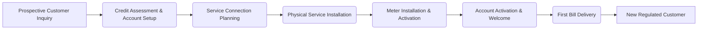
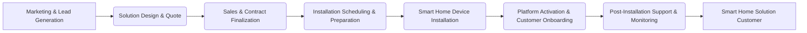
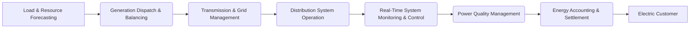

# Value Stream Diagrams - Overview
## Quantum Energy - Visualizing End-to-End Value Delivery

**Document Version:** 1.0
**Date:** 2025-11-25
**Scope:** High-level visualization of Quantum Energy's key value streams
**Target Audience:** Business Leaders, Process Owners, Solution Architects, Business Analysts
**Concerns Addressed:** Understanding end-to-end processes, identifying key stages, visualizing value creation.
**Primary Domains Covered:** Value Streams, Capabilities, Stakeholders
**Key Source Artifacts:**
*   [Enterprise Value Streams Catalog (ent-value-streams-catalog.md)](../../4-VALUE-STREAMS/ent-value-streams-catalog.md)
*   [Value Stream Stage Models](../../4-VALUE-STREAMS/value-stream-stage-models/)

---

## Executive Summary

This document provides high-level diagrams for Quantum Energy's most critical value streams. These visualizations illustrate the sequence of stages through which value is created and delivered to our stakeholders, encompassing both regulated utility services and non-regulated advanced energy solutions. They serve as a foundational tool for understanding operational flows, identifying interdependencies, and pinpointing areas for process optimization and capability enhancement.

---

## 1. Introduction

Value stream diagrams are visual representations of an end-to-end collection of activities that create value for a specific stakeholder. They are essential for communicating complex business processes in a clear and concise manner, facilitating alignment across diverse functional groups.

---

## 2. Key Value Stream Diagrams (High-Level Conceptual)

### 2.1. RCV-01: Regulated Customer Acquisition

**Purpose:** To onboard new customers for core utility services efficiently and compliantly.
**Concerns:** Customer onboarding experience, regulatory adherence, operational efficiency.
**Diagram:**


*(Refer to `../../4-VALUE-STREAMS/value-stream-stage-models/regulated-customer-value-streams/rcv-01-customer-acquisition-stages.md` for detailed stages and enabling capabilities.)*

### 2.2. NCV-01: Smart Home Solution Delivery

**Purpose:** To market, sell, install, and support non-regulated smart home energy management solutions.
**Concerns:** Market responsiveness, customer acquisition, efficient delivery, product functionality.
**Diagram:**


*(Refer to `../../4-VALUE-STREAMS/value-stream-stage-models/non-regulated-solution-delivery-value-streams/ncv-01-smart-home-installation-stages.md` for detailed stages and enabling capabilities.)*

### 2.3. AOV-04: Electric Energy Delivery

**Purpose:** To generate, transmit, and distribute electrical energy to customer meters reliably and safely.
**Concerns:** Grid reliability, operational efficiency, system balance, safety.
**Diagram:**


*(Refer to `../../4-VALUE-STREAMS/value-stream-stage-models/operations-value-streams/aov-04-electric-energy-delivery-stages.md` for detailed stages and enabling capabilities.)*

### 2.4. REV-01: Rate Case & Cost Recovery

**Purpose:** To secure regulatory approval for cost recovery through customer rates for regulated utility services.
**Concerns:** Financial viability, regulatory compliance, fair rates, stakeholder engagement.
**Diagram:**
```mermaid
graph LR
    A[Rate Case Strategy & Planning] --> B(Cost of Service Study & Revenue Req.)
    B --> C(Rate Design & Customer Impact Analysis)
    C --> D(Filing Preparation & Submission)
    D --> E(Discovery & Testimony)
    E --> F(Settlement Negotiation or Hearing)
    F --> G(Order Implementation & Compliance)
    G --> H[Quantum Energy (Financial Viability)]
```

*(Refer to `../../4-VALUE-STREAMS/value-stream-stage-models/regulatory-value-streams/rev-01-rate-case-stages.md` for detailed stages and enabling capabilities.)*

---

## 3. Usage & Further Detail

These high-level diagrams serve as entry points. For detailed information on each stage, including:
*   Enabling capabilities
*   Key metrics
*   Information inputs and outputs
*   Participating organizational units and roles
*   Identified pain points

Please refer to the specific value stream stage model documents located in the `../../4-VALUE-STREAMS/value-stream-stage-models/` directory.

---

## Document Control

**Author:** Quantum Energy Business Architecture Team
**Reviewers:** BA Review Board, Process Owners
**Approval:** Chief Enterprise Architect / Head of Business Architecture
**Version History:**
- v1.0 (2025-11-25): Initial Value Stream Diagrams Overview for Quantum Energy.

**Next Review:** Annually or upon significant changes to core value streams

---

**End of Document**
