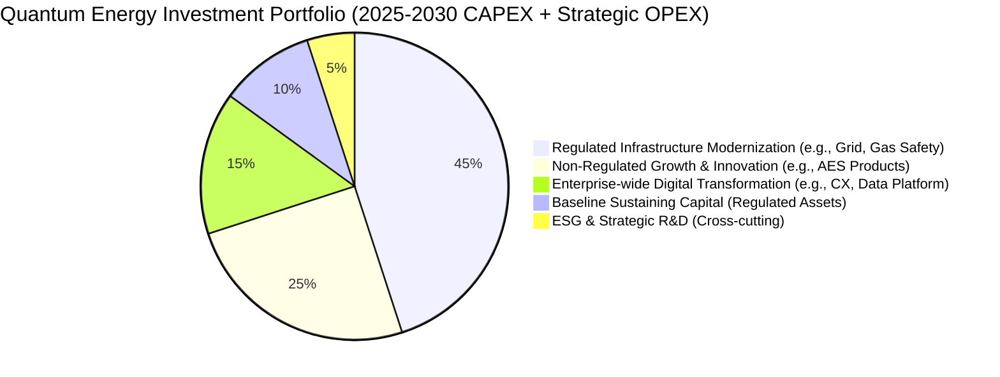

# Investment Portfolio View
## Quantum Energy - Strategic Capital Allocation Overview

**Document Version:** 1.0
**Date:** 2025-11-25
**Scope:** High-level overview of Quantum Energy's strategic investment portfolio and capital allocation
**Target Audience:** CEO, ELT, CFO, Board of Directors, BA Steering Committee
**Concerns Addressed:** Optimal allocation of capital, alignment with strategic objectives, balance between regulated and non-regulated investments.
**Primary Domains Covered:** Initiatives, Financial, Strategy
**Key Source Artifacts:**
*   [Enterprise Initiative Portfolio (ent-initiative-portfolio.md)](../../9-INITIATIVES/ent-initiative-portfolio.md)
*   [Enterprise Initiative Prioritization (ent-initiative-prioritization.md)](../../9-INITIATIVES/ent-initiative-prioritization.md)
*   [Quantum Energy Strategic Objectives](../../2-STRATEGY/ent-strategic-objectives.md)

---

## Executive Summary

This document provides a high-level Investment Portfolio View for Quantum Energy, illustrating the strategic allocation of our capital across various initiatives for the 2025-2030 period. The portfolio is designed to balance essential investments in regulated infrastructure for reliability and compliance with strategic capital directed towards non-regulated growth and enterprise-wide capabilities. This view supports transparent decision-making, ensures alignment with our dual imperative, and optimizes long-term value creation.

---

## 1. Portfolio Purpose & Design Principles

### 1.1. Purpose

To communicate and manage Quantum Energy's capital and strategic investment decisions, ensuring they effectively support our overall corporate strategy and financial objectives.

### 1.2. Design Principles

*   **Strategic Alignment:** Every investment is linked to specific strategic objectives.
*   **Balanced Portfolio:** Maintain an optimal balance between regulated (stable, predictable) and non-regulated (growth, higher risk/reward) investments.
*   **Value Optimization:** Prioritize investments that deliver the highest value (financial, operational, customer, ESG) relative to cost and risk.
*   **Resource Feasibility:** Ensure investments align with available financial and human capital resources.
*   **Transparency:** Provide clear visibility into where capital is being deployed.

---

## 2. Quantum Energy Investment Portfolio Allocation (Conceptual)

This view categorizes investments based on their primary strategic driver and regulatory scope.

**Interpretation:**
*   **Regulated Infrastructure Modernization (45%):** Largest share, reflecting ongoing commitment to reliability, safety, and compliance of core utility operations (e.g., DGPR-001). This includes investments in distribution automation, AMI, and pipeline integrity.
*   **Non-Regulated Growth & Innovation (25%):** Significant portion dedicated to scaling AES business, new product development, and market expansion (e.g., AES-G1, NEST-001). This reflects the strategic imperative for diversification.
*   **Enterprise-wide Digital Transformation (15%):** Investments in foundational platforms and capabilities that benefit the entire enterprise (e.g., UCE-001, CDP-001, WFD-001). These drive efficiency and enhance customer experience across all segments.
*   **Baseline Sustaining Capital (10%):** Ongoing, essential capital for maintaining existing regulated assets, distinct from modernization efforts.
*   **ESG & Strategic R&D (5%):** Smaller but critical investments in long-term sustainability initiatives and R&D for future energy solutions.

---

## 3. Investment Prioritization Summary (Top Initiatives)

This section summarizes how key initiatives are funded and their strategic priority, based on the framework outlined in `ent-initiative-prioritization.md`.

| Initiative ID | Initiative Name | Primary Investment Area | Strategic Priority (Score 1-5) | Estimated Total Cost (M$) | Primary Funding Source | Aligned Strategic Objective(s) |
| :------------ | :-------------- | :-------------------- | :----------------------------- | :------------------------ | :--------------------- | :----------------------------- |
| **DGPR-001** | Digital Grid Program | Regulated Infrastructure Modernization | 4.5 | 500 M | Rate Base (Regulated CAPEX) | 1.1, 1.3, 1.4 |
| **UCE-001** | Unified Customer Experience Program | Enterprise-wide Digital Transformation | 4.0 | 150 M | Operational/CAPEX (Mixed) | 2.1, 2.2, 2.3 |
| **NEST-001** | New Energy Solutions Transformation | Non-Regulated Growth & Innovation, ESG & Strategic R&D | 4.0 | 100 M | Non-Regulated CAPEX/OPEX, Grants | 3.1, 3.2, 3.3, 3.4 |
| **AES-G1** | Advanced Energy Solutions Growth Initiative | Non-Regulated Growth & Innovation | 4.8 | 200 M | Non-Regulated CAPEX/OPEX | 5.1, 5.2, 5.3, 5.4 |
| **CDP-001** | Customer Data Platform Implementation | Enterprise-wide Digital Transformation | 4.2 | 75 M | Operational/CAPEX (Mixed) | 2.3 |

---

## 4. Capital Governance & Oversight

*   **CFO & Financial Planning:** Responsible for overall capital planning, budgeting, and financial performance.
*   **BA Steering Committee:** Reviews and approves the strategic alignment of the investment portfolio.
*   **Investment Committee:** A dedicated committee responsible for reviewing business cases, assessing risks, and recommending approval of major capital projects to the ELT/Board.
*   **Project Management Office (PMO):** Tracks progress and expenditure of approved initiatives against budget.
*   **Value Realization Tracking:** Monitors the actual benefits delivered by investments against planned outcomes (`ent-value-realization-tracking.md`).

---

## Document Control

**Author:** Quantum Energy Strategic Planning Office, Finance, Business Architecture Teams
**Reviewers:** Executive Leadership Team, BA Steering Committee, Board of Directors
**Approval:** Chief Financial Officer (CFO)
**Version History:**
- v1.0 (2025-11-25): Initial Investment Portfolio View for Quantum Energy.

**Next Review:** Annually (as part of strategic planning and budgeting cycles)

---

**End of Document**
