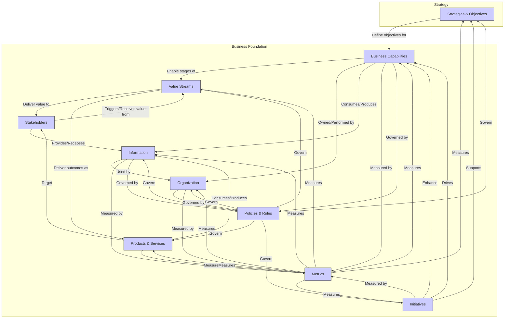

# Enterprise Complete Metamodel Mapping
## Quantum Energy - The Integrated Business Architecture Metamodel

**Document Version:** 1.0
**Date:** 2025-11-25
**Scope:** High-level overview of the complete BIZBOK metamodel relationships for Quantum Energy
**Framework Standards:** BIZBOK Guide to Business Architecture
**Related Documents:**
*   [Enterprise Business Architecture Knowledgebase Structure](../../1-FOUNDATION/ba-kb.md)
*   All individual cross-domain mapping documents within this directory.

---

## Executive Summary

This document provides a high-level overview of the complete BIZBOK metamodel relationships as applied to Quantum Energy. It illustrates the fundamental connections and interdependencies between all architectural domains: Capabilities, Value Streams, Products, Stakeholders, Information, Organization, Strategies, Initiatives, Policies, and Metrics. This integrated view is crucial for understanding how our business architecture provides a holistic blueprint that connects vision to reality across both regulated utility operations and non-regulated advanced energy solutions.

---

## 1. Introduction

The BIZBOK metamodel defines the structure and relationships between core business architecture domains. By mapping these relationships for Quantum Energy, we gain a comprehensive understanding of our enterprise architecture, enabling more informed decision-making, strategic alignment, and effective transformation.

---

## 2. Quantum Energy's Integrated Business Architecture Metamodel Diagram (Conceptual)

---

## 3. Core Metamodel Relationships (Quantum Energy Perspective)

### 3.1. Strategy Domain Relationships

*   **Strategies & Objectives define Business Capabilities:** Strategic goals (e.g., "Achieve 20% Non-Regulated Revenue") directly drive the need to enhance or create new capabilities (e.g., "Non-Regulated Product Development").
*   **Strategies & Objectives support Initiatives:** Strategic priorities guide the creation and prioritization of initiatives (e.g., "AES-G1 Advanced Energy Solutions Growth Initiative").

### 3.2. Capabilities Domain Relationships

*   **Capabilities enable Value Streams:** Capabilities (e.g., "Electric Distribution") are the reusable building blocks that enable the stages within value streams (e.g., "Electric Energy Delivery").
*   **Capabilities are owned by Organization:** Organizational units (e.g., "Electric Distribution Department") perform capabilities.
*   **Capabilities consume/produce Information:** Capabilities (e.g., "Metering and Measurement") interact with information entities (e.g., "Meter Reading").
*   **Capabilities are measured by Metrics:** Metrics (e.g., "Capability Maturity Level") assess the performance and maturity of capabilities.
*   **Capabilities are governed by Policies & Rules:** Policies (e.g., "Pipeline Safety Act") dictate how capabilities (e.g., "Gas Distribution") are executed.
*   **Capabilities are enhanced by Initiatives:** Initiatives (e.g., "Digital Grid Program") specifically target the improvement of capabilities (e.g., "Distribution Automation & Grid Modernization").

### 3.3. Value Streams Domain Relationships

*   **Value Streams deliver value to Stakeholders:** Value streams (e.g., "Regulated Customer Acquisition") have specific triggering and receiving stakeholders (e.g., "Prospective Regulated Customer" and "New Regulated Customer").
*   **Value Streams deliver outcomes as Products & Services:** Products (e.g., "Residential Electric Service") are the tangible results of value stream execution (e.g., "Electric Energy Delivery").
*   **Value Streams consume/produce Information:** Information (e.g., "Customer Account") flows across value stream stages.
*   **Value Streams are measured by Metrics:** Metrics (e.g., "Average Time to Connect New Service") assess the performance and efficiency of value streams.
*   **Value Streams are governed by Policies & Rules:** Policies (e.g., "Customer Service & Billing Rules") influence value stream execution.

### 3.4. Products & Services Domain Relationships

*   **Products & Services target Stakeholders:** Products (e.g., "Smart Home Energy Management") are designed for specific customer segments (e.g., "Smart Home Customers").
*   **Products & Services consume/produce Information:** Products rely on information (e.g., "Product Definition") and generate data (e.g., "Smart Device Data").
*   **Products & Services are measured by Metrics:** Metrics (e.g., "Non-Regulated Revenue Growth") track the success of products.
*   **Products & Services are governed by Policies & Rules:** Policies (e.g., "Non-Regulated Service Terms") define the commercial aspects of products.

### 3.5. Stakeholders Domain Relationships

*   **Stakeholders provide/receive Information:** Stakeholders exchange information with Quantum Energy.
*   **Stakeholders are measured by Metrics:** Metrics (e.g., "NPS") reflect stakeholder satisfaction.
*   **Stakeholders are governed by Policies & Rules:** Regulatory policies directly impact certain stakeholders (e.g., "Regulators").

### 3.6. Information Domain Relationships

*   **Information is owned/used by Organization:** Organizational units are responsible for specific information assets.
*   **Information is measured by Metrics:** Metrics (e.g., "Data Quality Scores") assess the quality of information.
*   **Information is governed by Policies & Rules:** Policies (e.g., "Data Privacy Policy") dictate how information is managed.

### 3.7. Organization Domain Relationships

*   **Organization implements Initiatives:** Organizational units execute initiatives.
*   **Organization is measured by Metrics:** Metrics (e.g., "Employee Engagement Score") reflect organizational health.
*   **Organization is governed by Policies & Rules:** Corporate policies define organizational structure and conduct.

---

## 4. Quantum Energy's Cross-Domain Mapping Documents

This directory contains individual documents detailing specific cross-domain relationships:

*   **[ent-strategy-to-capability.md](ent-strategy-to-capability.md)**
*   **[ent-capability-to-value-stream.md](ent-capability-to-value-stream.md)**
*   **[ent-value-stream-to-stakeholder.md](ent-value-stream-to-stakeholder.md)**
*   **[ent-product-to-value-stream.md](ent-product-to-value-stream.md)**
*   **[ent-capability-to-organization.md](ent-capability-to-organization.md)**
*   **[ent-capability-to-information.md](ent-capability-to-information.md)**
*   **[ent-initiative-to-capability.md](ent-initiative-to-capability.md)**
*   **[ent-policy-to-capability.md](ent-policy-to-capability.md)**

---

## Document Control

**Author:** Quantum Energy Business Architecture Team
**Reviewers:** Enterprise Architecture, BA Steering Committee
**Approval:** Chief Enterprise Architect / Head of Business Architecture
**Version History:**
- v1.0 (2025-11-25): Initial Enterprise Complete Metamodel Mapping for Quantum Energy.

**Next Review:** Annually or upon significant changes to the BA framework

---

**End of Document**
