# Enterprise Capability Model Overview (L0-L2)
## Quantum Energy

**Document Version:** 1.0
**Date:** 2025-11-25
**Standard:** BIZBOK Guide to Business Architecture
**Scope:** High-level overview of Quantum Energy's Enterprise Capability Model

---

## Executive Summary

This document provides a high-level overview of Quantum Energy's Business Capability Model, illustrating the hierarchical structure from Level 0 (Enterprise) to Level 2 (Tactical capabilities). For detailed definitions, decomposition, and context of each Level 1 and Level 2 capability, please refer to the comprehensive `ent-capabilities-l1-l2.md` document. This overview serves as a quick reference and an entry point to the full capability model.

---

## 1. Quantum Energy Business Capability Hierarchy

The Quantum Energy Business Capability Model is structured in a hierarchical manner, adhering to BIZBOK guidelines:

*   **Level 0: Enterprise (Quantum Energy: Integrated Energy Utility & Solutions Provider)**
    *   Represents the entire organization and its overarching mission.
    *   The single highest-level capability that encompasses all others.

*   **Level 1: Strategic Capabilities**
    *   Broad, strategic functions that the enterprise performs.
    *   These capabilities define the major business domains and strategic areas of focus.
    *   Examples include "Energy Generation," "Customer Engagement & Service," "Non-Regulated Product Development."

*   **Level 2: Tactical Capabilities**
    *   Decompositions of Level 1 capabilities into more specific, tactical business functions.
    *   These are the building blocks that enable the Level 1 capabilities.
    *   Examples include "Renewable Generation Operations" (under Energy Generation), "Digital Customer Experience" (under Customer Engagement & Service), "Product Concept & Design" (under Non-Regulated Product Development).

*   **Level 3+: Operational Capabilities**
    *   Further granular decomposition of Level 2 capabilities into operational processes and activities.
    *   These are typically defined in separate, more detailed documents, such as those found in `capability-model-l3-detailed/`.

---

## 2. Accessing the Detailed Capability Model

For a complete and detailed understanding of Quantum Energy's Level 1 and Level 2 capabilities, including their definitions, scope, strategic classification (Regulated, Non-Regulated, Enterprise), and cross-capability dependencies, please refer to the following document:

*   **[Enterprise Capabilities - Level 1 and Level 2 (ent-capabilities-l1-l2.md)](./ent-capabilities-l1-l2.md)**

This comprehensive document is the primary source for L1 and L2 capability information within Quantum Energy's Business Architecture Knowledgebase.

---

## 3. L0-L2 Capability Diagram (Conceptual)

Below is a conceptual representation of the capability hierarchy.

```mermaid
graph TD
    A[L0: Quantum Energy Enterprise] --> B(L1: Strategic Capabilities)
    A --> C(L1: Core Capabilities)
    A --> D(L1: Supporting Capabilities)

    B --> B1(L2: Enterprise Strategy & Performance Management)
    B --> B2(L2: Market Development & Competitive Intelligence)
    B --> B3(L2: Regulatory & Government Affairs)
    B --> B4(L2: Brand & Reputation Management)

    C --> C1(L2: Energy Generation)
    C --> C2(L2: Natural Gas Supply & Storage)
    C --> C3(L2: Energy Transmission)
    C --> C4(L2: Electric Distribution)
    C --> C5(L2: Gas Distribution)
    C --> C6(L2: Customer Engagement & Service)
    C --> C7(L2: Non-Regulated Product Development)
    C --> C8(L2: Non-Regulated Sales & Marketing)
    C --> C9(L2: System Operations & Grid Control)

    D --> D1(L2: Financial Management)
    D --> D2(L2: Human Capital Management)
    D --> D3(L2: Information Technology & Digital Services)
    D --> D4(L2: Procurement & Supply Chain Management)
    D --> D5(L2: Legal & Compliance)
```

*(Note: For full list of L1 and L2 capabilities and their definitions, refer to [ent-capabilities-l1-l2.md](./ent-capabilities-l1-l2.md))*

---

## Document Control

**Author:** Quantum Energy Business Architecture Team
**Reviewers:** BA Review Board
**Approval:** Chief Enterprise Architect / Head of Business Architecture
**Version History:**
- v1.0 (2025-11-25): Initial overview of L0-L2 Capability Model.

**Next Review:** Annual or upon significant changes to the capability model

---

**End of Document**
