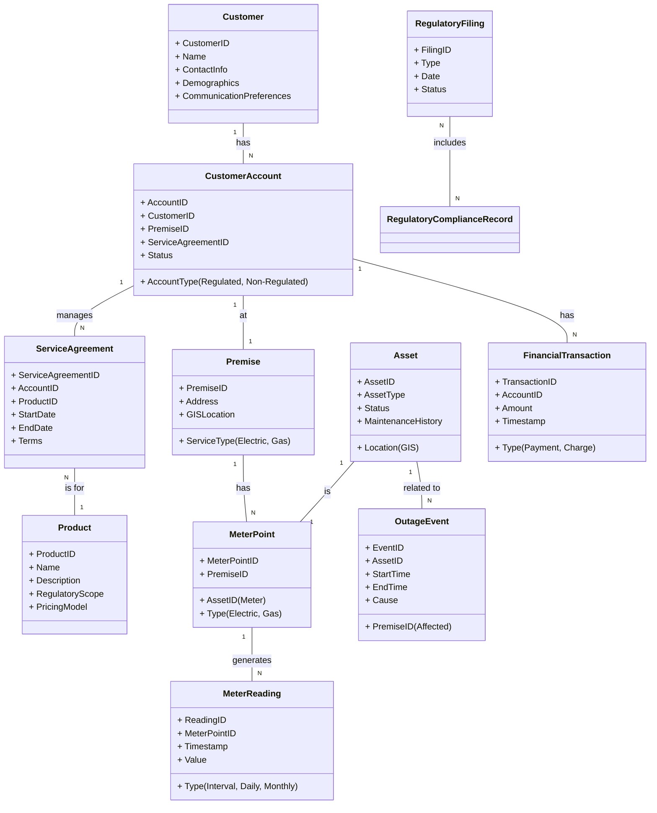

# Enterprise Business Information Model - Conceptual
## Quantum Energy - High-Level Data Architecture

**Document Version:** 1.0
**Date:** 2025-11-25
**Scope:** High-level conceptual business information model for Quantum Energy
**Framework Standards:** BIZBOK, DAMA-DMBOK
**Related Documents:**
*   [Enterprise Capabilities - Level 1 and Level 2](../../3-CAPABILITIES/ent-capabilities-l1-l2.md)
*   [Enterprise Value Streams Catalog](../../4-VALUE-STREAMS/ent-value-streams-catalog.md)

---

## Executive Summary

This document presents a high-level conceptual Business Information Model for Quantum Energy. It identifies the critical information domains and entities that the business consumes, produces, and manages, illustrating their key relationships. This model provides a foundational understanding of our data landscape, crucial for data governance, system design, analytics, and ensuring data integrity across both our regulated utility operations and non-regulated advanced energy solutions.

---

## 1. Introduction & Purpose

A Business Information Model defines the essential business concepts and their relationships, independent of specific applications or technologies. It serves as a common language for business and IT stakeholders, enabling:
*   Clear communication about data.
*   Identification of information assets.
*   Consistent data definitions and quality standards.
*   Strategic data architecture planning.
*   Understanding data flow across value streams and capabilities.
*   Addressing data separation and sharing requirements between regulated and non-regulated business units.

---

## 2. Key Information Domains & Entities (Conceptual)

Quantum Energy's business information model is structured around several core domains, each containing key business information entities.

### 2.1. Customer Information Domain

*   **Description:** Information pertaining to all individuals and organizations that interact with Quantum Energy, across regulated utility services and non-regulated offerings.
*   **Key Entities:**
    *   **Customer Account:** Unique identifier for a customer's relationship with Quantum Energy (can be linked to multiple services/products).
    *   **Customer Profile:** Demographic details, contact information, communication preferences, service history, regulated/non-regulated product subscriptions.
    *   **Premise:** Physical location where services are provided.
    *   **Service Agreement:** Contractual terms for regulated utility service or non-regulated product/service.
    *   **Billing & Payment History:** Records of invoices, payments, adjustments.
    *   **Interaction History:** Records of customer service calls, digital interactions, field visits.
    *   **Non-Regulated Product Data:** Configuration, usage data, warranty info for smart devices, EV chargers, etc.
*   **Relationship Focus:** Unified customer view, data separation for regulatory compliance.

### 2.2. Energy Consumption & Metering Data Domain

*   **Description:** Information related to the measurement and tracking of energy consumption (electric and natural gas) and generation.
*   **Key Entities:**
    *   **Meter Point:** Unique identifier for a physical meter at a premise.
    *   **Meter Reading:** Interval data, daily reads, monthly reads.
    *   **Consumption Profile:** Aggregated consumption patterns.
    *   **Generation Data:** Data from customer-sited generation (e.g., solar panels), utility-owned generation.
    *   **DER Data:** Real-time data from distributed energy resources (e.g., smart thermostats, EV chargers participating in grid programs).
*   **Relationship Focus:** AMI integration, data analytics for insights, billing, grid operations.

### 2.3. Asset & Infrastructure Information Domain

*   **Description:** Information pertaining to Quantum Energy's physical assets used for energy delivery, generation, and non-regulated solutions.
*   **Key Entities:**
    *   **Asset:** Unique identifier for any physical asset (e.g., transformer, pipeline, EV charging station, smart home hub).
    *   **Asset Type:** Classification (e.g., generation, transmission, distribution, non-regulated customer-sited).
    *   **Asset Location:** GIS coordinates, service address.
    *   **Asset Attributes:** Manufacturer, model, installation date, capacity, status.
    *   **Maintenance History:** Records of inspections, repairs, maintenance schedules.
    *   **Performance Data:** Real-time sensor data, operational efficiency.
*   **Relationship Focus:** Asset lifecycle management, predictive maintenance, grid modernization.

### 2.4. Operational Information Domain

*   **Description:** Information essential for the real-time monitoring, control, and management of energy delivery systems and field operations.
*   **Key Entities:**
    *   **Grid State:** Real-time status of the electric grid (voltage, current, frequency).
    *   **Pipeline State:** Real-time status of the gas network (pressure, flow).
    *   **Outage Event:** Records of service disruptions, restoration times.
    *   **Work Order:** Instructions for field activities (maintenance, installation, repair).
    *   **Crew Dispatch:** Status and location of field personnel.
    *   **DER Dispatch:** Instructions and responses for distributed energy resources.
*   **Relationship Focus:** System reliability, emergency response, operational efficiency.

### 2.5. Financial & Regulatory Information Domain

*   **Description:** Information related to Quantum Energy's financial performance, accounting, and compliance with regulatory requirements.
*   **Key Entities:**
    *   **Financial Transaction:** General ledger entries, payments, revenues, expenses.
    *   **Budget & Forecast:** Financial plans and projections.
    *   **Tariff/Rate Schedule:** Approved pricing structures for regulated services.
    *   **Regulatory Filing:** Documents submitted to regulatory bodies.
    *   **Cost Allocation:** Methodologies and records for allocating costs between regulated and non-regulated activities.
    *   **Compliance Record:** Documentation of adherence to regulatory standards.
*   **Relationship Focus:** Financial integrity, regulatory oversight, investment justification.

### 2.6. Product & Market Information Domain

*   **Description:** Information related to Quantum Energy's product offerings, market intelligence, and competitive landscape.
*   **Key Entities:**
    *   **Product Definition:** Features, pricing, terms, regulatory scope (regulated/non-regulated).
    *   **Market Segment:** Characteristics of target customer groups.
    *   **Competitor Profile:** Information on market rivals (especially non-regulated).
    *   **Sales Opportunity:** Leads, sales pipeline data for non-regulated products.
    *   **Marketing Campaign:** Details of promotional activities.
*   **Relationship Focus:** Product development, market expansion, competitive strategy.

---

## 3. Conceptual Information Model Diagram

---

## 4. Key Considerations for Data Management

*   **Unified Customer View:** While ensuring data separation for regulatory purposes, Quantum Energy aims for a holistic view of the customer to enhance experience across all offerings.
*   **Data Governance:** Robust governance is critical to manage data quality, ownership, access, and security, especially when integrating data from diverse sources and across regulated/non-regulated boundaries.
*   **Regulatory Compliance:** Strict adherence to regulatory requirements for data segregation, privacy, and reporting for regulated operations.
*   **Data Privacy & Security:** Particularly important for non-regulated products that collect granular customer behavior and smart device data.
*   **Analytics & AI:** The model provides the foundation for advanced analytics and AI applications to derive insights for operational efficiency, grid modernization, and personalized customer offerings.

---

## Document Control

**Author:** Quantum Energy Business Architecture Team
**Reviewers:** Enterprise Architecture, Data Governance Council, IT Leadership, Legal & Regulatory, BA Review Board
**Approval:** Chief Data Officer, Chief Information Officer
**Version History:**
- v1.0 (2025-11-25): Initial high-level conceptual Business Information Model for Quantum Energy.

**Next Review:** Annually or upon significant changes to business operations or data strategy

---

**End of Document**
