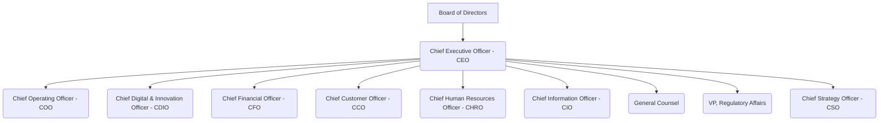

# Quantum Energy Organizational Structure
## High-Level Reporting Lines and Business Units

**Document Version:** 1.0
**Date:** 2025-11-25
**Scope:** High-level organizational structure of Quantum Energy
**Framework Standards:** BIZBOK
**Related Documents:**
*   [Enterprise Capabilities - Level 1 and Level 2](../../3-CAPABILITIES/ent-capabilities-l1-l2.md)
*   [Enterprise Capability to Organization Mapping](../../3-CAPABILITIES/ent-capability-to-org-mapping.md)
*   [Quantum Energy Strategic Plan](../../2-STRATEGY/ent-strategic-plan.md)

---

## Executive Summary

This document outlines the high-level organizational structure of Quantum Energy, reflecting our dual imperative to excel in regulated utility operations while driving growth in non-regulated advanced energy solutions. The structure is designed to ensure efficient and compliant delivery of core services, foster agility and innovation in competitive markets, and leverage shared enterprise services to optimize performance across the entire company.

---

## 1. Introduction

Quantum Energy's organizational structure is designed to support its strategic objectives, providing clarity of roles, responsibilities, and reporting lines. It aims to balance the stability required for regulated operations with the flexibility needed for non-regulated market ventures, while maintaining a unified corporate identity.

---

## 2. Executive Leadership Team & Board Oversight

Quantum Energy is led by a Chief Executive Officer (CEO) who reports to the Board of Directors. The Executive Leadership Team (ELT) comprises key functional and business unit heads, ensuring strategic alignment and oversight across the enterprise.



---

## 3. High-Level Organizational Chart

The structure is broadly divided into three main pillars: **Regulated Operations**, **Advanced Energy Solutions (Non-Regulated)**, and **Enterprise Services (Shared Functions)**.

```mermaid
graph TD
    A[Board of Directors] --> B(Chief Executive Officer - CEO)

    subgraph Executive Leadership Team
        B --> COO(Chief Operating Officer - COO)
        B --> CDIO(Chief Digital & Innovation Officer - CDIO)
        B --> CFO(Chief Financial Officer - CFO)
        B --> CCO(Chief Customer Officer - CCO)
        B --> CHRO(Chief Human Resources Officer - CHRO)
        B --> CIO(Chief Information Officer - CIO)
        B --> GC(General Counsel)
        B --> VPRA(VP, Regulatory Affairs)
        B --> CSO(Chief Strategy Officer - CSO)
    end

    subgraph Regulated Operations (COO)
        COO --> VPEG(VP, Electric Generation)
        COO --> VPET(VP, Electric Transmission)
        COO --> VPED(VP, Electric Distribution)
        COO --> VPNGS(VP, Natural Gas Supply & Storage)
        COO --> VPNGD(VP, Natural Gas Distribution)
    end

    subgraph Advanced Energy Solutions (CDIO)
        CDIO --> VPPD(VP, Product Development - AES)
        CDIO --> VPMS(VP, Sales & Marketing - AES)
        CDIO --> VPOS(VP, Operations & Delivery - AES)
        CDIO --> VPBD(VP, Business Development - AES)
    end

    subgraph Enterprise Services (Shared Functions)
        CFO --> VPFT(VP, Finance & Treasury)
        CFO --> VPAC(VP, Accounting & Regulatory Acc.)
        CCO --> VPCS(VP, Customer Service & Experience)
        CCO --> VPCA(VP, Corporate & Public Affairs)
        CHRO --> VPTP(VP, Talent & Performance)
        CHRO --> VPLD(VP, Learning & Development)
        CIO --> VPIT(VP, IT Operations & Infrastructure)
        CIO --> VPDA(VP, Data & Analytics)
        GC --> VPLGL(VP, Legal & Governance)
        VPRA --> VPRG(VP, Regulatory & Government Relations)
        CSO --> VPES(VP, Enterprise Strategy & Planning)
        CSO --> VPBD_Corp(VP, Corporate Business Development)
    end
```

---

## 4. Key Organizational Pillars & Responsibilities

### 4.1. Regulated Operations Division (Reporting to COO)

*   **Responsibility:** Ensures the safe, reliable, and efficient operation of Quantum Energy's regulated electric and natural gas infrastructure. Manages generation assets, transmission networks, and distribution systems. Adheres strictly to regulatory compliance.
*   **Key Departments:** Electric Generation, Electric Transmission, Electric Distribution, Natural Gas Supply & Storage, Natural Gas Distribution.
*   **Focus:** Capital investment, asset management, operational excellence, grid modernization, safety.

### 4.2. Advanced Energy Solutions (AES) Business Unit (Reporting to CDIO)

*   **Responsibility:** Develops, markets, sells, and delivers non-regulated, utility-supporting, and utility-like advanced energy products and services. Drives innovation and profitable growth in competitive markets.
*   **Key Departments:** Product Development, Sales & Marketing, Operations & Delivery, Business Development (for new ventures/partnerships).
*   **Focus:** Market agility, innovation, customer acquisition/retention in non-regulated space, profitability, strategic partnerships.

### 4.3. Enterprise Services (Shared Functions)

*   **Responsibility:** Provides centralized support functions and shared services to the entire Quantum Energy enterprise (both Regulated Operations and AES). Ensures consistency, efficiency, and scale across the company.
*   **Key Departments & Reporting Lines:**
    *   **Finance (Reporting to CFO):** Finance & Treasury, Accounting & Regulatory Accounting.
    *   **Customer & External Affairs (Reporting to CCO):** Customer Service & Experience, Corporate & Public Affairs.
    *   **Human Resources (Reporting to CHRO):** Talent & Performance, Learning & Development.
    *   **Information Technology (Reporting to CIO):** IT Operations & Infrastructure, Data & Analytics.
    *   **Legal (Reporting to General Counsel):** Legal & Governance.
    *   **Regulatory (Reporting to VP, Regulatory Affairs):** Regulatory & Government Relations.
    *   **Strategy (Reporting to CSO):** Enterprise Strategy & Planning, Corporate Business Development.
*   **Focus:** Operational efficiency, governance, talent management, financial integrity, cybersecurity, data management, strategic planning for the entire enterprise.

---

## 5. Interdependencies and Collaboration

*   **Regulated-Non-Regulated Interface:** While distinct, the AES Business Unit relies on Regulated Operations for core utility service and infrastructure, particularly for DER and EV solutions. Strong coordination is required.
*   **Shared Services Utilization:** Both Regulated Operations and AES leverage Enterprise Services for foundational support (e.g., IT systems, HR functions, financial reporting).
*   **Strategic Alignment:** The Chief Strategy Officer plays a key role in ensuring that both regulated and non-regulated activities are aligned with Quantum Energy's overarching strategic plan.
*   **Compliance:** Legal and Regulatory Affairs provide guidance to all parts of the organization to ensure compliance, particularly for regulated/non-regulated separation.

---

## Document Control

**Author:** Quantum Energy Human Resources, Strategy, Business Architecture Teams
**Reviewers:** Executive Leadership Team, Board of Directors
**Approval:** Chief Executive Officer (CEO)
**Version History:**
- v1.0 (2025-11-25): Initial high-level Organizational Structure for Quantum Energy.

**Next Review:** Annually or upon significant organizational changes

---

**End of Document**
