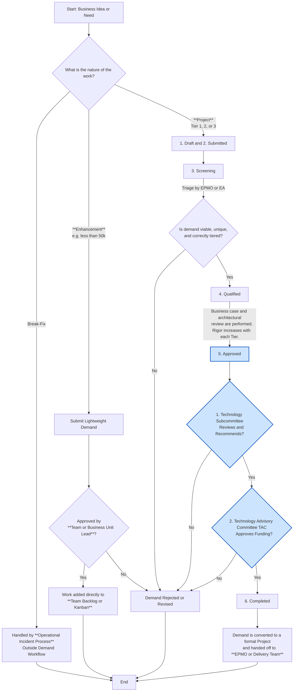

# Demand Management Workflow Visual

This document contains a Mermaid diagram illustrating the consolidated demand management workflow for all project types. This version has been rewritten for improved compatibility and rendering.

